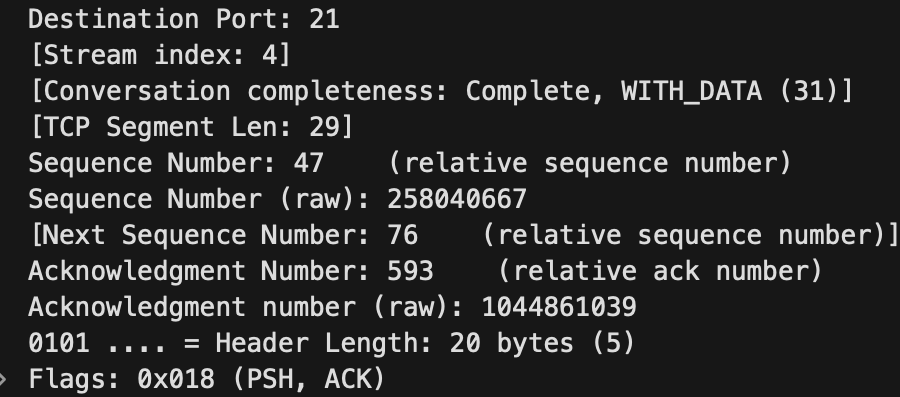
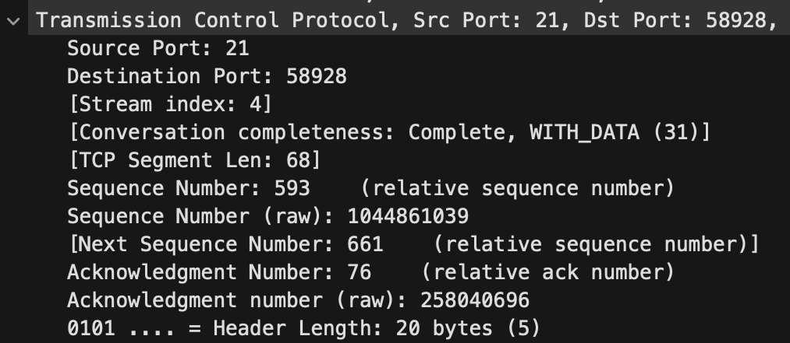
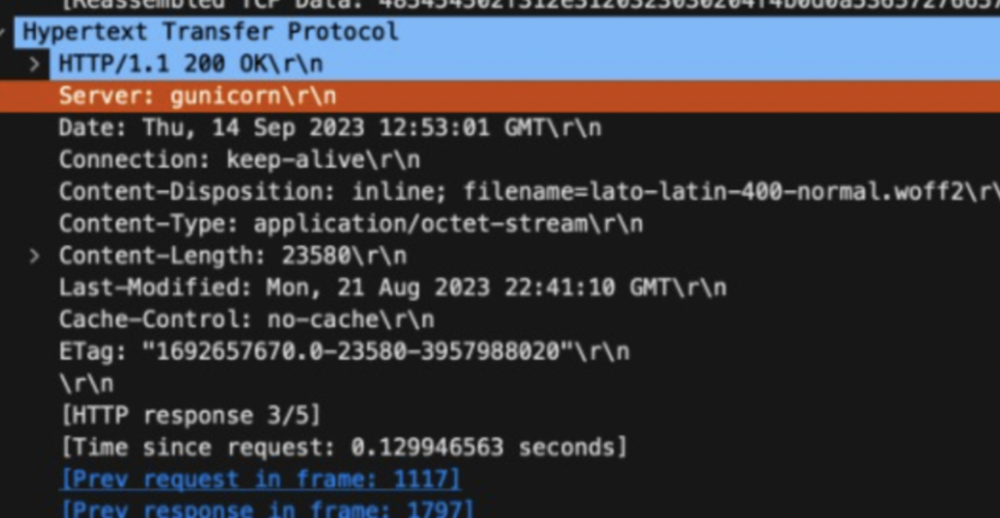

# Jarkom-Modul-1-A19-2023

## No 1
User melakukan berbagai aktivitas dengan menggunakan protokol FTP. Salah satunya adalah mengunggah suatu file.

a. Berapakah sequence number (raw) pada packet yang menunjukkan aktivitas tersebut? 

b. Berapakah acknowledge number (raw) pada packet yang menunjukkan aktivitas tersebut? 

c. Berapakah sequence number (raw) pada packet yang menunjukkan response dari aktivitas tersebut?

d. Berapakah acknowledge number (raw) pada packet yang menunjukkan response dari aktivitas tersebut?

Kita dapat memeriksa protokol FTP untuk melihat nomor urutan (sequence number) dan nomor akui (acknowledge number). Pada poin a, kita diminta untuk menjawab apa nomor urutan (sequence number) (raw) pada paket, dan jawabannya adalah 258040667. Kemudian pada poin b, kita diminta untuk menjawab nomor akui (acknowledge number) (raw) pada paket, dan jawabannya adalah 1044861039.

Setelah itu, kita perlu mencari respons dari aktivitas tersebut, yaitu angka setelah 147, yang adalah 149. Dengan pertanyaan yang sama seperti sebelumnya, tetapi kali ini adalah respons, pada poin c dan d, jawabannya adalah 1044861039 dan 258040696 masing-masing.

## No 2
Sebutkan web server yang digunakan pada portal praktikum Jaringan Komputer!
'''http.server'''

Kita dapat memeriksa alamat IP, kemudian kita periksa pada informasi yang memiliki (teks/html). Pada paket tersebut, kita periksa Protokol Transfer Hiperteks dan kita mendapatkan nama servernya, yaitu gunicorn.

