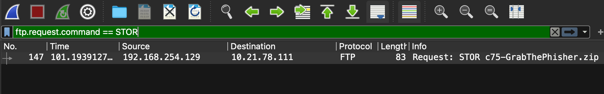

# Jarkom-Modul-1-A19-2023

# Kelompok A19:
| Nama | NRP |
| ---------------------- | ---------- |
| Nayya Kamila Putri Y | 5025211183 |
| Javier Nararya Aqsa Setiyono | 5025211245 |

## No 1
User melakukan berbagai aktivitas dengan menggunakan protokol FTP. Salah satunya adalah mengunggah suatu file.

a. Berapakah sequence number (raw) pada packet yang menunjukkan aktivitas tersebut? 

b. Berapakah acknowledge number (raw) pada packet yang menunjukkan aktivitas tersebut? 

c. Berapakah sequence number (raw) pada packet yang menunjukkan response dari aktivitas tersebut?

d. Berapakah acknowledge number (raw) pada packet yang menunjukkan response dari aktivitas tersebut?




Kita dapat memeriksa protokol FTP untuk melihat nomor urutan (sequence number) dan nomor akui (acknowledge number). Pada poin a, kita diminta untuk menjawab apa nomor urutan (sequence number) (raw) pada paket, dan jawabannya adalah 258040667. Kemudian pada poin b, kita diminta untuk menjawab nomor akui (acknowledge number) (raw) pada paket, dan jawabannya adalah 1044861039.


Setelah itu, kita perlu mencari respons dari aktivitas tersebut, yaitu angka setelah 147, yang adalah 149. Dengan pertanyaan yang sama seperti sebelumnya, tetapi kali ini adalah respons, pada poin c dan d, jawabannya adalah 1044861039 dan 258040696 masing-masing.

## No 2
Sebutkan web server yang digunakan pada portal praktikum Jaringan Komputer!
```
http.server
```

Kita dapat memeriksa alamat IP, kemudian kita periksa pada informasi yang memiliki (teks/html). Pada paket tersebut, kita periksa Protokol Transfer Hiperteks dan kita mendapatkan nama servernya, yaitu gunicorn.


## No 3
Dapin sedang belajar analisis jaringan. Bantulah Dapin untuk mengerjakan soal berikut:

a. Berapa banyak paket yang tercapture dengan IP source maupun destination address adalah 239.255.255.250 dengan port 3702? 

b. Protokol layer transport apa yang digunakan?

Menggunakan query
```
ip.host == 239.255.255.250 and udp.port == 3702
```


Di foto terlihat bahwa ada sebanyak 21 paket yang menggunakan protokol layer transport UDP

## No 4

## No 5

## No 6
Seorang anak bernama Udin Berteman dengan SlameT yang merupakan seorang penggemar film detektif. sebagai teman yang baik, Ia selalu mengajak slamet untuk bermain valoranT bersama. suatu malam, terjadi sebuah hal yang tak terdUga. ketika udin mereka membuka game tersebut, laptop udin menunjukkan sebuah field text dan Sebuah kode Invalid bertuliskan "server SOURCE ADDRESS 7812 is invalid". ketika ditelusuri di google, hasil pencarian hanya menampilkan a1 e5 u21. jiwa detektif slamet pun bergejolak. bantulah udin dan slamet untuk menemukan solusi kode error tersebut.

Pertama kita perlu mencari file nomor 7812, lalu salin source addressnya dan di-decrypt. Didapatkan source addressnya adalah 104.18.14.101


Hasilnya setelah di-decrypt adalah JDRNJA


## No 7
Berapa jumlah packet yang menuju IP 184.87.193.88?

Menggunakan query
```
ip.dst == 184.87.193.88
```
Dapat ditemukan ada 6 packet


## No 8
Berikan kueri filter sehingga wireshark hanya mengambil semua protokol paket yang menuju port 80! (Jika terdapat lebih dari 1 port, maka urutkan sesuai dengan abjad)

Menggunakan query
```
tcp.dstport == 80 || udp.dstport == 80
```
Karena kita perlu mencari port tujuan dari koneksi TCP atau UDP


## No 9
Berikan kueri filter sehingga wireshark hanya mengambil paket yang berasal dari alamat 10.51.40.1 tetapi tidak menuju ke alamat 10.39.55.34!
```
ip.src == 10.51.40.1 && ip.dst != 10.39.55.34
```
Untuk menemukan paket yang diinginkan, kita perlu membuat kueri yang dapat mengurutkan data berdasarkan alamat IP sumber dan alamat IP tujuan.

ip.src == 10.51.40.1 berarti memfilter paket yang berasal dari alamat ip 10.51.40.1. 

ip.dst != 10.39.55.34 mengindikasikan memfilter paket yang memiliki alamat IP tujuan yang bukan 10.39.55.34.

## No 10
